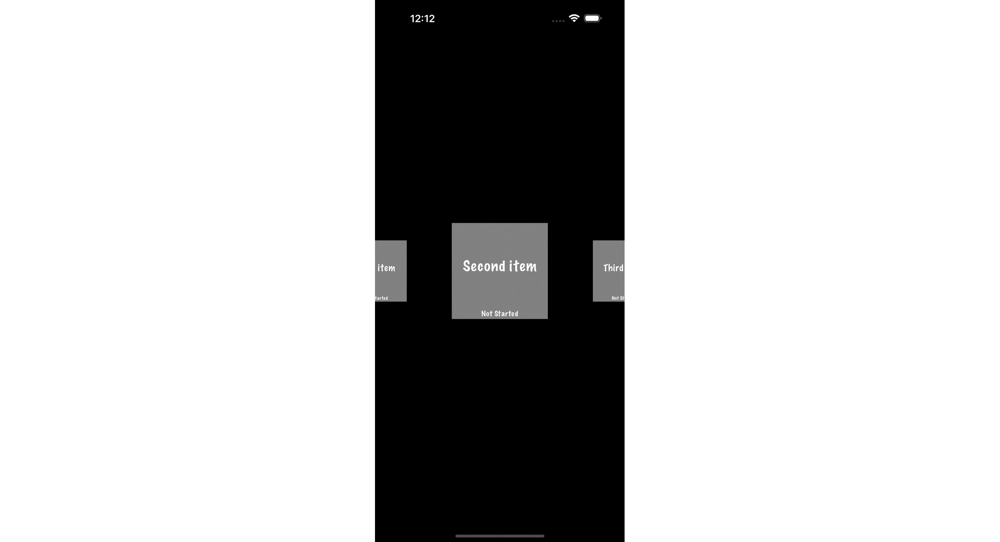

#  Carousel

This is a sample project based upon https://stackoverflow.com/a/79398905/1271826.

The salient aspects are:

 1. Do not update cell with progress by reloading the snapshot if you're going to be doing `isHighlighted` sorts of animations. Just have the cell update itself.

 2. I have simplified the JSON, `carouselData`. I have also simplified the cell. But this is unrelated to the basic fix, namely stop reloading the cell.

 3. FWIW, I have retired `IndexPath` based updating. I have also created a new `Download` object to keep track of the individual downloads.
 
 4. Since OP was using Combine elsewhere, I used `ObservableObject` with `@Published` property to monitor the state changes.
 
Developed in Xcode 16.2 and Swift 5.

- - -

Rob Ryan
January 30, 2025
